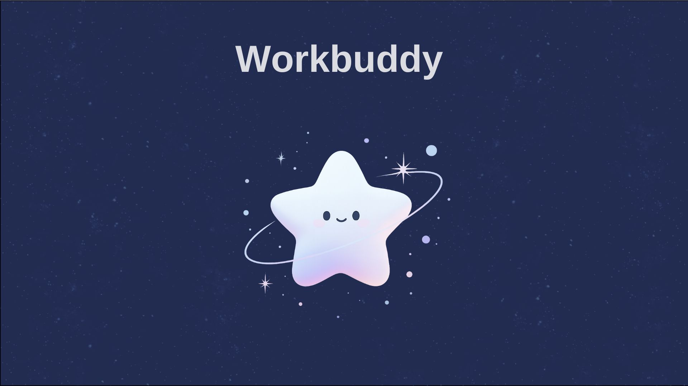
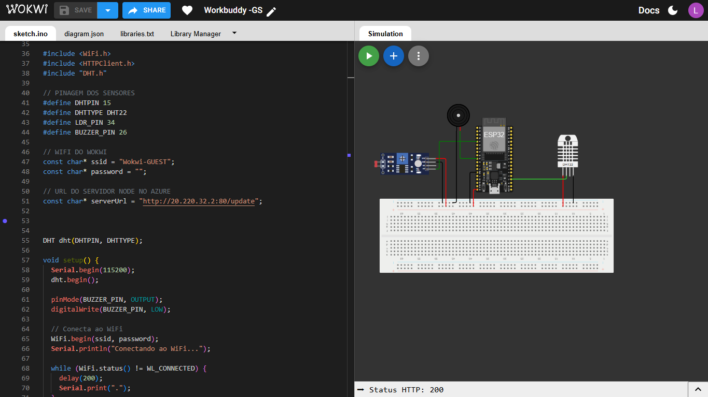
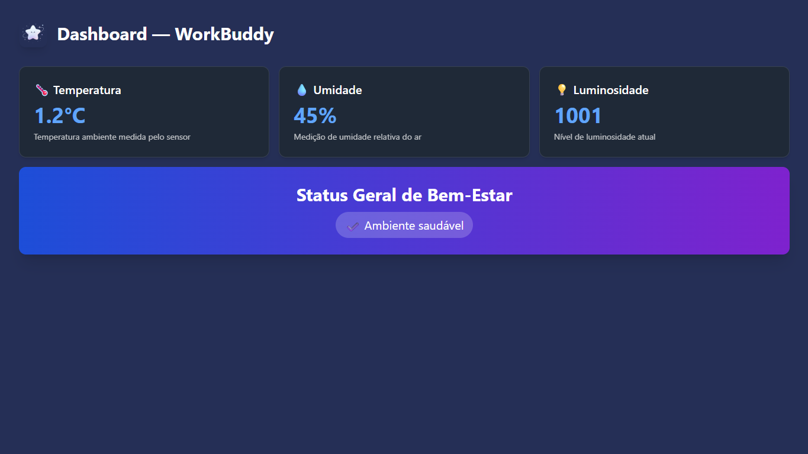

# WorkBuddy – Monitoramento de Bem-Estar no Ambiente de Trabalho 

Assista ao vídeo no YouTube clicando no banner abaixo.

[](https://www.youtube.com/watch?v=d10wl5W8q14)


## Tema – Global Solution 2025

Com o avanço da automação, IoT e digitalização do trabalho, garantir que profissionais atuem em ambientes saudáveis e produtivos tornou-se um desafio importante. Trabalhar por longos períodos em condições inadequadas (calor, iluminação ruim, ar seco, longas jornadas sem pausas, etc.) impacta saúde, bem-estar, foco e desempenho.

O **WorkBuddy** é uma solução IoT que monitora em tempo real condições do ambiente de trabalho e **avisa o colaborador quando é hora de fazer uma pausa**, incentivando uma rotina mais saudável e alinhada ao futuro do trabalho digital.

---


## 🧩 Arquitetura do Sistema

```
ESP32 (Wokwi) → HTTP POST → Servidor Node.js (Azure) → Status via Dashboard Web
```

### Componentes usados

* ESP32 no simulador Wokwi
* Sensor **DHT22** (temperatura e umidade)
* Sensor **LDR** (luminosidade)
* **Buzzer** (alerta ao usuário)
* Servidor **Node.js + Express**
* VM Ubuntu no **Microsoft Azure**
* Comunicação HTTP 

---

## 🛠 Funcionamento

### ESP32

* Lê os sensores a cada 2 segundos.
* Monta um JSON com os dados coletados.
* Envia via HTTP `POST /update` para a API Node.js.
* Se o ambiente estiver desconfortável:

```
Temperatura > 30°C
Umidade < 30%
Luz < 300
```

o buzzer toca para avisar o colaborador que é hora de ajustar o ambiente ou fazer uma pausa.

## 📦 Dependências do Projeto

### 🔹 ESP32 (Wokwi)

O código do microcontrolador depende das seguintes bibliotecas:

* WiFi.h (nativa do ESP32)
* HTTPClient.h (nativa do ESP32)
* DHT.h

* Biblioteca utilizada para leitura do sensor DHT22

Essas dependências já estão disponíveis automaticamente no ambiente Wokwi.

---

### 🔹 Servidor Node.js (Azure)

O servidor utiliza os seguintes pacotes:

```bash
npm install express cors body-parser
```

**Descrição dos pacotes:**

| Pacote        | Função                                  |
| ------------- | --------------------------------------- |
| `express`     | Framework para criar o servidor HTTP    |
| `cors`        | Liberação de acesso via APIs remotas    |
| `body-parser` | Interpretação de JSON recebido via POST |

O servidor é executado em uma VM Linux no Microsoft Azure.

---

### 🔹 Hardware utilizado (simulado)

* ESP32
* Sensor DHT22 (temperatura e umidade)
* Sensor LDR (luminosidade)
* Buzzer (alerta sonoro)

Todos os componentes são simulados pelo ambiente Wokwi.


### Servidor Node.js

* Recebe os dados via endpoint `/update`.
* Processa os valores e determina o estado de bem-estar.
* Mantém o último valor em memória.
* Disponibiliza dados via navegador em:

```
GET /status
```

---

## 📡 Endpoints HTTP

### Envio de dados (ESP → Azure)

```
POST /update
Content-Type: application/json
```

Payload de exemplo:

```json
{
"temperatura": 26.8,
"umidade": 51,
"luz": 410
}
```

### Consulta de status (Dashboard Web)

```
GET /status
```

Retorno:

```json
{
"temperatura": 26.8,
"umidade": 51,
"luz": 410,
"bemEstar": "✔ Ambiente saudável"
}
```

---


## 🌐 Link da Simulação Wokwi


```
https://wokwi.com/projects/447996331973310465
```

---

## ⚙️ Instruções de Uso

### 1️- Clonar o Repositório

```bash
git clone https://github.com/LauraBarret0/IOT-Edge-Computing-Workbuddy.git

cd IOT-Edge-Computing-Workbuddy

```

---

### 2️- Instalar Dependências do Servidor (Node.js)

No terminal da sua VM Azure:

```bash
cd backend
npm install
```

---

### 3️- Executar o Servidor Node.js

Ainda dentro da pasta do servidor:

```bash
node server.js
```

Se tudo estiver correto, você verá:

```
Servidor rodando na porta 80...
```

---

### 4️- Copiar o IP Público da VM Azure

Na VM, rode:

```bash
curl ifconfig.me
```

Copie o endereço exibido, por exemplo:

```
20.220.32.2
```

---

### 5️- Configurar o ESP32 (no Wokwi)

No código `.ino`, altere a linha:

```cpp
const char* serverUrl = "http://SEU-IP-AQUI:80/update";
```

Exemplo:

```cpp
const char* serverUrl = "http://20.220.32.2:80/update";
```

---

### 6️- Abrir o Projeto no Wokwi

Acesse o link do simulador:

```
https://wokwi.com/projects/447996331973310465
```

Clique em **“Run”** para iniciar o ESP32.

---

### 7️- Verificar se os dados estão chegando ao servidor

No terminal da VM, você deverá ver algo como:

```
Recebido:
Temperatura: 26.8
Umidade: 52
Luz: 410
```

---

### 8️- Visualizar os dados no Navegador

Abra no navegador:

```
http://SEU-IP-AQUI/status
```

Exemplo:

```
http://20.220.32.2/status
```

A página exibirá:

```json
{
"temperatura": 26.8,
"umidade": 52,
"luz": 410,
"bemEstar": "✔ Ambiente saudável"
}
```

---

### 9️- Interpretação dos Alertas

Se qualquer uma das condições abaixo ocorrer:

* Temperatura > 30°C
* Umidade < 30%
* Luminosidade < 300

O **buzzer do ESP32 será acionado**, indicando ao usuário que:

➡ É hora de ajustar o ambiente
➡ Fazer uma pausa ou descanso
➡ Melhorar as condições de trabalho

---

## 🖼 Imagens do Projeto


<br><br>

---

## 📁 Arquivos do Projeto

* `server.js` – API em Node.js
* `index.html` – painel de visualização
* `workbuddy.ino` – código do ESP32

---

## 🚀 Resultados Esperados

O projeto demonstra uma aplicação prática de IoT onde:

* o ambiente de trabalho é monitorado em tempo real
* o colaborador recebe alertas se estiver em condições desconfortáveis
* os dados podem ser observados via navegador
* a solução integra Edge Computing, nuvem e telemetria

---

